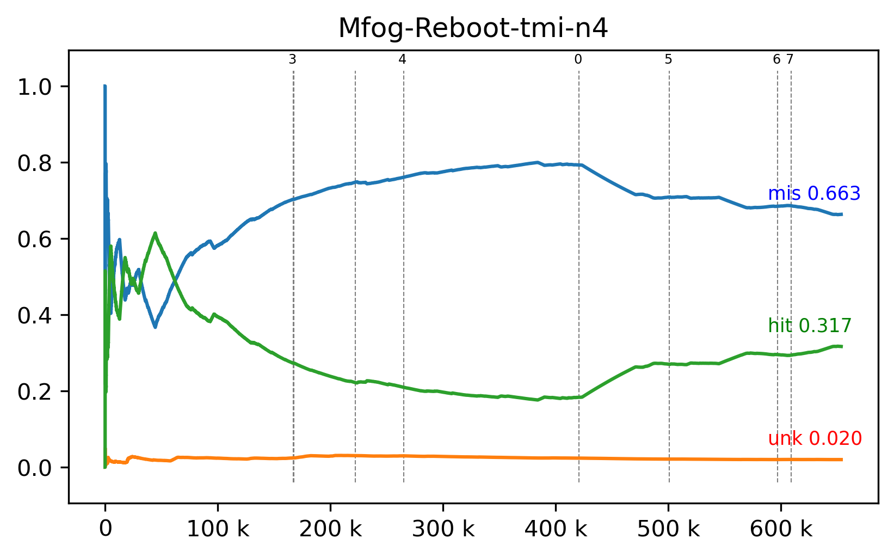
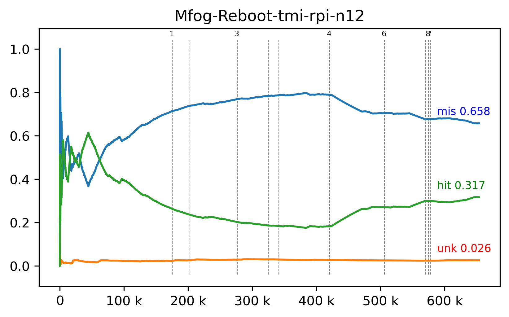

# Reboot mfog e mpi

A hipótese é de que na versão serial novidades sejam detectadas imediatamente
resultando em maior taxa de acerto (_hits_), enquanto na versão distribuída
a detecção de novidades executando em paralelo e não atualizará o modelo
imediatamente levando a maior taxa de desconhecidos e erros (_unknowns_, _misses_).

```log
Serial Confusion Matrix
Classes (act)       A       N assigned    hits
Labels (pred)                                 
-               10263    3122        -       0
0                1172      47        A    1172
1                 208       0        A     208
2                 943     126        A     943
3                   0      56        N      56
4                 771      15        A     771
5                   2      30        N      30
6                1486       0        A    1486
7                   1       0        A       1
8                  31       3        A      31
9                  58       3        A      58
N              432690  203351        N  203351

Hits               208107 ( 31.802261%)
Misses             432886 ( 66.152285%)
Unknowns            13385 (  2.045454%)
Total              654378 (100.000000%)

Threaded MPI Confusion Matrix
Classes (act)       A       N assigned    hits
Labels (pred)                                 
-               22772    2842        -       0
3                   3       0        A       3
N              424404  203436        N  203436

Hits               203439 ( 31.132682%)
Misses             424404 ( 64.947403%)
Unknowns            25614 (  3.919762%)
Total              653457 ( 99.999847%)
```

Avaliando as matrizes de confusão e gráficos do fluxo a hipótese é corroborada.
Mais especificamente _Hits_ reduz `4668` (`0.669579%`),
_Unknowns_ cresce `12229` (`1.874308%`)
e o primeiro item classificado como novidade é de índice `9618` na versão serial
e índice `355119` na versão distribuída.

Além disso é notável que na versão serial a detecção de novidades foi executada
`8` vezes contra `6` na versão distribuída e há indicação que desconhecidos
são descartados por falta de capacidade no conjunto de desconhecidos.
Além disso a demora na propagação do modelo pode gerar desconhecidos
que são tratados na detecção de novidade mesmo que se re-classificados
antes do passo de clusterização.

## 2020-11-17 18:31

- [x] Stdout un-buffer ou local file;
  - `The MPI standard does not specify how stdout from different nodes should be
    collected for printing at the originating process.`
    https://stackoverflow.com/a/5310506/1774806
  - local file: vide proximo item;
- [x] n-threads classifier, 1 processo por nó;
  - Não vale a pena pois não tem vantagem, a origem (_stream source_) é única e o destino (_stream sink_) também deve ser.
- [x] Add ip resolution to /etc/hosts;
  - Improved base-time (cluster setup) from 1m40s to 1.1s;
  - In novelty detection increased labels from 1 to 4. time stil 65-75s;
- [x] swapping-buffer-pair e threads para MPI_send no classifier;
- [x] Garbage collect unknowns instead of realloc (mixed);

## 2020-11-23 15:14





```log
Mfog-Reboot-serial 260.3630 seconds
Classes (act)       A       N assigned    hits
Labels (pred)                                 
-               10263    3122        -       0
0                1172      47        A    1172
1                 208       0        A     208
2                 943     126        A     943
3                   0      56        N      56
4                 771      15        A     771
5                   2      30        N      30
6                1486       0        A    1486
7                   1       0        A       1
8                  31       3        A      31
9                  58       3        A      58
N              432690  203351        N  203351
Labels (item)          12
Hits               208107 ( 31.802261%)
Misses             432886 ( 66.152285%)
Unknowns            13385 (  2.045454%)
```

```log
Mfog-Reboot-tmi-n4 105.3122 seconds
Classes (act)       A       N assigned    hits
Labels (pred)                                 
-               10046    2967        -       0
0                 127      40        A     127
1                 191       0        A     191
2                 936      99        A     936
3                   0      54        N      54
4                2705     157        A    2705
5                   2       0        A       2
6                   0       2        N       2
7                   1       0        A       1
N              433171  202959        N  202959
Labels (item)          10
Hits               206977 ( 31.674109%)
Misses             433467 ( 66.334332%)
Unknowns            13013 (  1.991406%)
```

```log
Mfog-Reboot-tmi-rpi-n12 87.17293 seconds
Classes (act)       A       N assigned    hits
Labels (pred)                                 
-               13415    3460        -       0
0                 128      40        A     128
1                 923      96        A     923
2                   0      43        N      43
3                3097     126        A    3097
4                   0       4        N       4
5                 274      89        A     274
6                   1       0        A       1
7                   0       4        N       4
8                   0       1        N       1
9                  19       1        A      19
N              429322  202414        N  202414
Labels (item)          12
Hits               206908 ( 31.663550%)
Misses             429674 ( 65.753882%)
Unknowns            16875 (  2.582415%)
```

| Summary | Serial    | 1x4       |             | 3x4       |             |
| --------| ------    | -------   | :--         | -------   | ----        |
| Hits    | 208107    | 206977    | _0.994570_  | 206908    | _0.994238_  |
| Time    | 260.3630  | 105.3122  | _0.510325_  | 87.17293  | _0.422451_  |
| Speedup |           | 2.472296657  |          | 2.986741412 |   |
| Time*core | 260.36  | 421.2488    |           | 1046.07516 |   |
